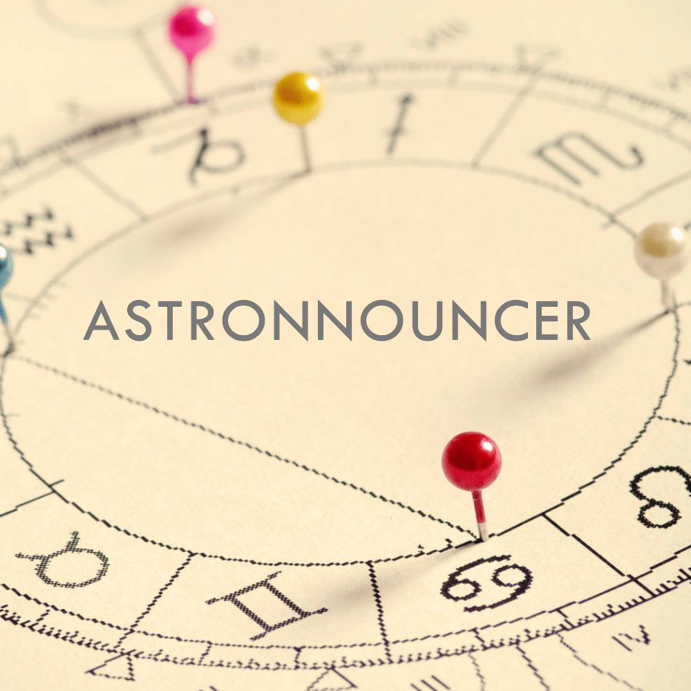

# Astronnouncer - A simple Discord bot



Astronnouncer is a very lightweight Discord bot based on the amazing [Swiss Ephemeris](https://www.astro.com/swisseph/swephinfo_e.htm) that planetary movements.

Since v1.1.1, detecting major aspects (conjunctions, sextiles, squares, trines, oppositions) is also supported.

## Got feature requests?

Don't be shy! Feel free to [submit them publicly on my GitHub repo](https://github.com/sdee3/astronnouncer/issues/new)!

### Upcoming features

1. Announcing Retrogrades, planets entering and leaving shadow, Mercury / Venus retrograde cazimis.

## Production environment setup

To get your bot deployed, set the following `.env` variables:

```txt
DISCORD_BOT_TOKEN="DISCORD_BOT_TOKEN"
GENERAL_CHANNEL_ID="GENERAL_CHANNEL_ID"
```

Run `pnpm start:prod` to launch a `pm2` instance that monitors the production Node build in the background.
